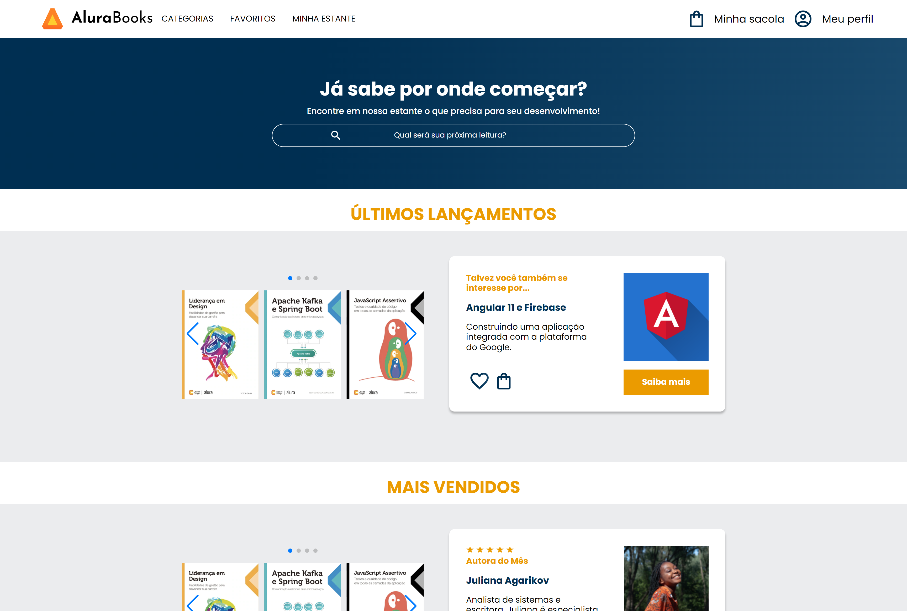

# Alura Books

>Curso HTML e CSS: responsividade com mobile-first

Projeto construído na formação de HTML e CSS. No curso desenvolvemos o site em 3 versões, foram celular, tablet e desktop. 
Foi abordado o display flex, mas o rodapé da versão desktop eu optei por utilizei grid.

[Clique aqui para acessar](https://joaquimtoin.github.io/alura-books/)

#Tecnologias

- HTML
- CSS
- Swiper JS